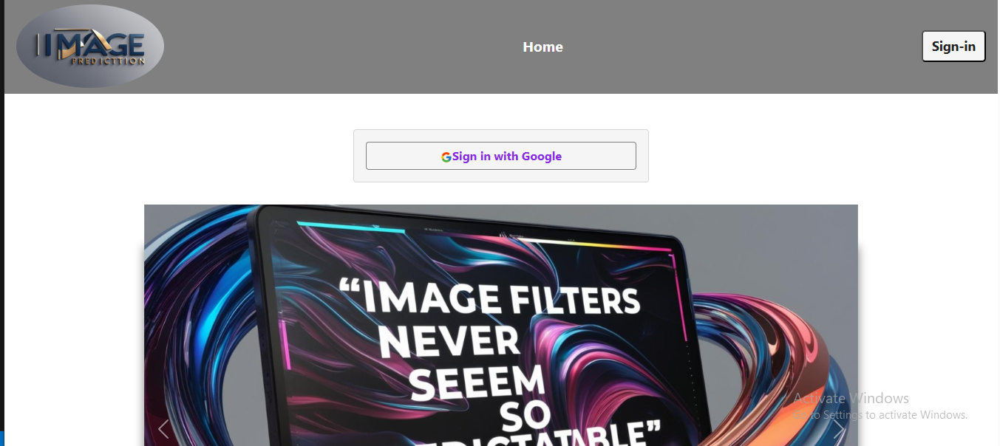
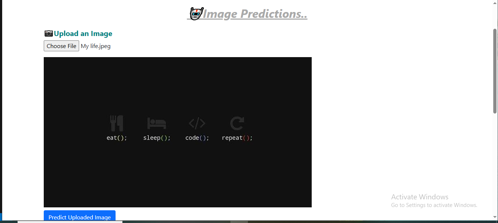
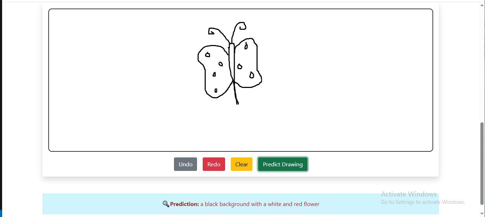

# 🧠 Image Prediction Web App

This is a smart web app that allows users to **upload an image** or **draw using a whiteboard**, and get an **AI-generated caption** instantly. Built with modern tech, it combines creativity with the power of AI image recognition.

## Home Page

##  Image Upload

## Image Text

## Drawing Board

---

## 🚀 Features

- 📷 **Upload or Draw**: Users can upload any image or draw freehand on a digital canvas.
- 🤖 **AI-Based Prediction**: Uses Hugging Face's BLIP model to generate intelligent captions.
- ☁️ **Cloudinary Integration**: Images are uploaded to Cloudinary for reliable hosting.
- 🔐 **Firebase Authentication**: Secure login and signup support.
- 🖼️ **Whiteboard with Konva.js**: Clean canvas for drawing images.
- 💡 **User-Friendly Interface**: Polished UI with emojis and interactive feedback.

---

## 🛠️ Tech Stack

- **React + TypeScript**
- **Konva.js** – for drawing whiteboard
- **Cloudinary** – image upload & hosting
- **Hugging Face Inference API** – for image captioning
- **Firebase** – authentication
- **Bootstrap** – responsive styling
- **Axios** – API requests

---

## 🧪 Challenges Faced

- Handling **CORS issues** with Cloudinary and Hugging Face APIs.
- Dealing with **403 and 503 errors** when the inference model was cold or blocked.
- Converting **drawings to base64** and uploading them as valid images.
- Ensuring proper formatting of image URLs for AI predictions.

---

## 📚 What I Learned

- How to integrate **AI models** (BLIP) into frontend projects.
- Efficient use of **Konva.js** for dynamic canvas drawing.
- Secure image handling via **Cloudinary** uploads.
- Working with **Firebase Authentication** and React context.
- Best practices for handling **asynchronous image uploads and predictions**.

---

## 💡 Future Improvements

- ✅ Add **download** functionality for drawings.
- ✅ Improve **error handling** with custom messages and fallback UI.
- ✅ Let users choose different **AI models** (like object detection or style transfer).

---

## 🔗 Live Demo

Check out the deployed version here:  
👉 [Live on GitHub Pages](https://shubhra-d.github.io/Image_Predictors/)

---

